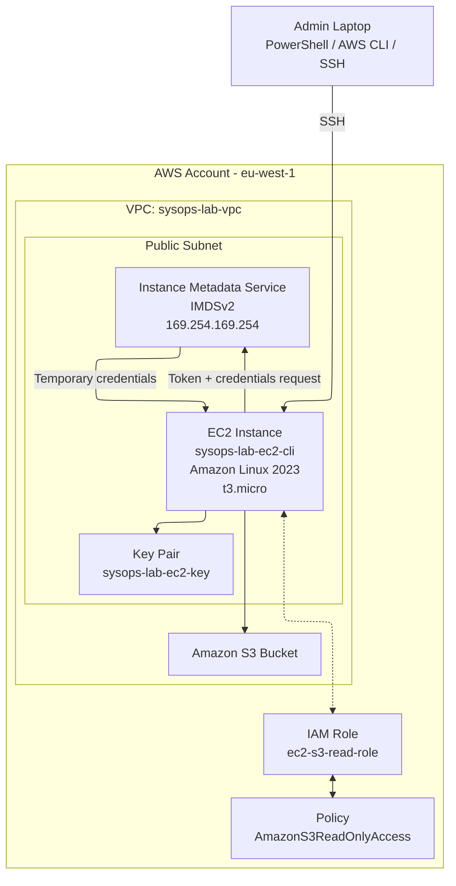

# AWS EC2 configuration IAM  Lab


## Objective: 
Demonstrate secure access to AWS services from an EC2 instance using an IAM role and temporary credentials, avoiding the use of long-lived access keys on the instance.

### Key concepts demonstrated:
- EC2 instance provisioning (Console and CLI)
- AMI discovery via AWS CLI
- IAM roles for EC2
- Instance Metadata Service (IMDSv2)
- Temporary credential issuance
- S3 access using role-based authentication
- Infrastructure lifecycle management

### Environment
```
Region: eu-west-1
Instance type used: t3.micro
Operating system: Amazon Linux 2023
```

## 1.0 — EC2 Launch (Console)
Instance created manually via AWS Console. Configured within a DEFAULT VPC. Security Group configured to only allow inbound connections from my IP address.

### Configuration:
```
Instance Name: sysops-lab-ec2-console
Instance Type: t3.micro
Key Pair: sysops-lab-ec2-key
Security Group: launch-wizard-1
Public IPv4: Assigned automatically
```

### Verification:
Instance state confirmed running
Status checks passed 2/2
SSH connectivity verified

### Observation:
Public IPv4 was assigned automatically as the instance was launched in a subnet with Auto-assign public IP enabled.


## 2.0 — AMI Discovery (CLI)
AMI was identified programmatically using the AWS CLI. EC2 Instance launched via Powershell. Confirmed instance state and config. Used "aws ec2-describe-images...--owners amazon" to choose the most up to date ami. Used filters to only show AMI's for Amazon Linux 2023 x86_64. EC2 deployment via CLI enables repeatable infrastructure as code deployments. When spinning up an individual instance, this workflow route may be more time consuming than using the Amazon console. 

Command:
```
aws ec2 describe-images --owners amazon \
--filters "Name=name,Values=al2023-ami-*-x86_64" "Name=state,Values=available" \
--query "Images[*].[ImageId,Name]" \
--output table \
--profile sysops-lab
```

Selected AMI:
ami-008f3b045fbd24779

Reasoning: Filtering ensures the instance uses an official Amazon Linux 2023 image that is currently available in the region.


## 3.0 — EC2 Launch (CLI)
Instance launched via command line.

Command used:
```
aws ec2 run-instances \
--image-id ami-008f3b045fbd24779 \
--count 1 \
--instance-type t3.micro \
--key-name sysops-lab-ec2-key \
--security-groups launch-wizard-1 \
--tag-specifications "ResourceType=instance,Tags=[{Key=Name,Value=sysops-lab-ec2-cli}]" \
--profile sysops-lab \
--region eu-west-1
```

### Instance details:
Instance Name: sysops-lab-ec2-cli
Instance ID: i-0d5e1766e99478514
Public IPv4: 54.216.104.38

Verification command:

```
aws ec2 describe-instances \
--filters "Name=tag:Name,Values=sysops-lab-ec2-cli" \
--query "Reservations[*].Instances[*].[InstanceId,State.Name,PublicIpAddress]" \
--output table
```

## 4.0 — IAM Role Configuration
IAM role created:
ec2-s3-read-role
Initial policy attached:
AmazonS3ReadOnlyAccess

Role attached to EC2 instance through:
EC2 → Actions → Security → Modify IAM role

- IAM role applied to EC2 instance to allow read only access to s3 buckets.
- No static credentials were configured on the EC2 instance.
- `aws s3 ls` succeeded using temporary role-based credentials.

## 5.0 — Instance Metadata Service (IMDSv2)
IMDSv2 token retrieved:

```
TOKEN=$(curl -X PUT "http://169.254.169.254/latest/api/token" \
-H "X-aws-ec2-metadata-token-ttl-seconds: 21600")

Role name retrieved from metadata:
curl -H "X-aws-ec2-metadata-token: $TOKEN" \
http://169.254.169.254/latest/meta-data/iam/security-credentials/

Temporary credentials retrieved:
curl -H "X-aws-ec2-metadata-token: $TOKEN" \
http://169.254.169.254/latest/meta-data/iam/security-credentials/ec2-s3-read-role
```

Returned credentials included:
- AccessKeyId
- SecretAccessKey
- Session Token
- Expiration

These credentials are temporary and automatically rotated. 

- IMDSv2 token flow was required to query metadata manually.
- Issue: Plain "curl" was not working so token request was required to get temporary credentials. 


## 6.0 — Role-Based Access Test
Without configuring credentials on the instance aws s3 ls successfully listed S3 buckets.

This confirms:
EC2 Instance
→ IAM Role
→ IMDSv2
→ Temporary credentials
→ AWS API access

No access keys were stored on the server.


## 7.0 — Permission Removal Test
The S3 policy was removed from the role applied to the EC2 instance.

Expected behaviour: aws s3 ls resulted in AccessDenied. This demonstrates the difference between authentication of a role and actions the role is authorised to take.

The instance could still obtain credentials but had no permissions to perform actions.

## 8.0 — Teardown
All resourced terminated and removed to prevent unnecessary cost. 
- EC2 instances terminated
- S3 Bucket emptied and deleted
- IAM Role removed
- Generated RSA key pairs removed
