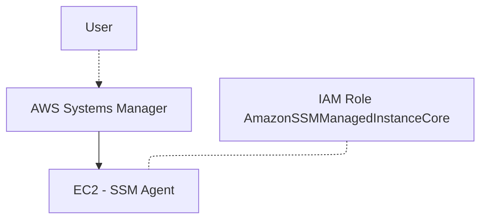

```mermaid
---
config:
    layout: elk
---
flowchart TD

User
AWS1[AWS Systems Manager]
AWS2[EC2 - SSM Agent]
IAM[IAM Role AmazonSSMManagedInstanceCore]

User -.-> AWS1
AWS1 --> AWS2

IAM -.- AWS2
```

