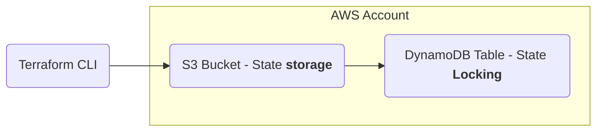

# Terraform Remote Backend
## Objective: 
Configure a remote Terraform backend using Amazon S3 for state storage and DynamoDB for state locking, enabling safe, consistent, and collaborative infrastructure management.

### Key concepts demonstrated:
- Terraform state management
- Remote backend configuration
- Separation of state from local environment
- State locking and concurrency control
- Secure storage of infrastructure metadata
- Backend configuration lifecycle ( terraform init, reconfigure)

## Architecture



## Steps Performed:

### 1. Created S3 Bucket for State Storage

Enabled versioning and blocked all public access.
</br>

### 2. Created DynamoDB Table for Locking

- Partition key: LockID (String)

- On-demand capacity


### 3. Configured Terraform Backend

Added backend block to root module:

```hcl

backend "s3" {

  bucket         = "tf-state-<name>"

  key            = "vpc/terraform.tfstate"

  region         = "eu-west-1"

  dynamodb_table = "tf-state-lock"

  encrypt        = true

}
```