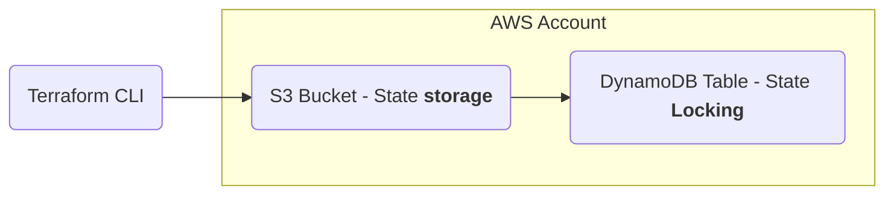

# Terraform Remote Backend
## Objective: 
Configure a remote Terraform backend using Amazon S3 for state storage and DynamoDB for state locking, enabling safe, consistent, and collaborative infrastructure management.

### Key concepts demonstrated:
- Terraform state management
- Remote backend configuration
- Separation of state from local environment
- State locking and concurrency control
- Secure storage of infrastructure metadata
- Backend configuration lifecycle ( terraform init, reconfigure)

## Architecture



## Steps Performed:

### 1. Created S3 Bucket for State Storage

Enabled versioning and blocked all public access.
</br>

### 2. Created DynamoDB Table for Locking

- Partition key: LockID (String)

- On-demand capacity


### 3. Configured Terraform Backend

Added backend block to root module:

```hcl

backend "s3" {

  bucket         = "tf-state-<name>"

  key            = "vpc/terraform.tfstate"

  region         = "eu-west-1"

  dynamodb_table = "tf-state-lock"

  encrypt        = true

}
```

### 4. Terraform init and state checks
I used terraform init, terraform plan, then terraform apply. Upon completion, I checked that s3 exists.

### 5. Check configured state
Removed .tfstate files using `Remove-Item terraform.tfstate` and `Remove-Item terraform.tfstate.backup` from local directory and re-applied `terraform plan`. 

After re-applying terraform plan, and received:

```
No changes. Your infrastructure matches the configuration.
```
This confirms that terraform is no longer using the local .tfstate files for the terraform backend.


### Troubleshooting
Re-encountered a configuration issue in my local CLI when using terraform init. This issue with `aws configure sts-get-caller-identity. 

Logged in using sso, however terraform would not use the authenticated sso profile.

I used: `$env:AWS_PROFILE = "sysops-lab"` to define the aws profile that PowerShell would use. 

