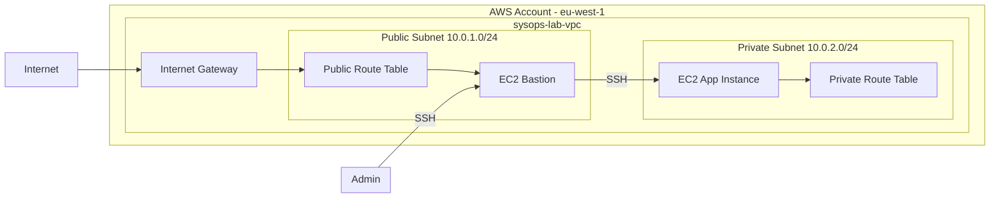

# Network Architecture

```mermaid

    flowchart LR
    
    
    
    subgraph AWS [AWS Account - eu-west-1]
        subgraph VPC [sysops-lab-vpc </br>10.0.0.0/16]
            IGW[Internet Gateway] 
            subgraph Public [Public Subnet 10.0.1.0/24]
                EC2Bastion[EC2 Bastion <br/>]
                PublicRoute[Public Route Table]
                
            end
            subgraph Private [Private Subnet 10.0.2.0/24]
                EC2App[EC2 App Instance]
                PrivateRoute[Private Route Table]
            end
        end
    end
    
    subgraph Admin [Admin]
          
    end
   
    Internet -->IGW
    IGW -->PublicRoute
    PublicRoute -->EC2Bastion
    EC2Bastion-->|SSH|EC2App
    Admin -->|SSH|EC2Bastion
    EC2App -->PrivateRoute
    
    
```

## Route table
|Route name | Routes |
| --- | --- |
| Public | local 10.0.0.0/16   sysops-igw 0.0.0.0/0 |
| Private | local 10.0.0.0/16 