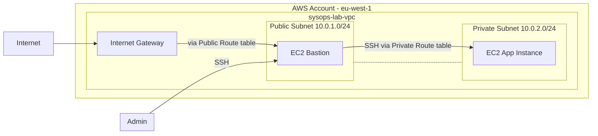

# Network Architecture

## Route tables
### Public 
|Subnet | Route type |Route |
| --- | --- | --- |
| Private | local | 10.0.0.0/16 
| Public| sysops-igw | 0.0.0.0/0

### Private
|Subnet | Route type |Route |
| --- | --- | --- |
| Private | local |10.0.0.0/16 